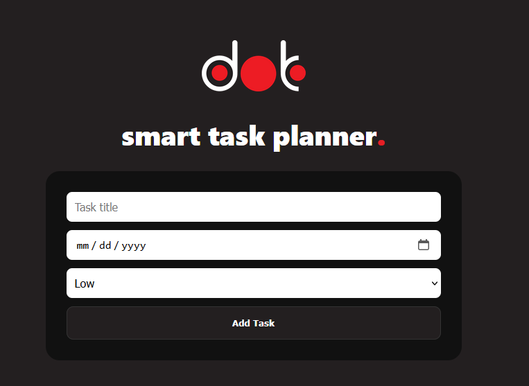
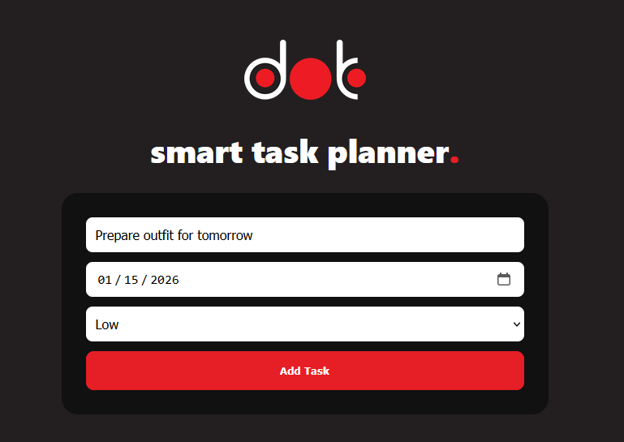
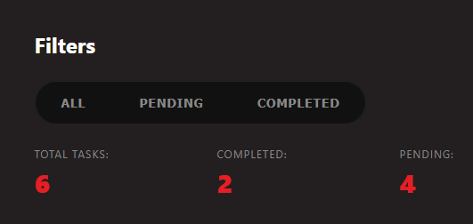
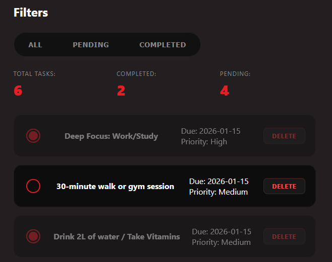
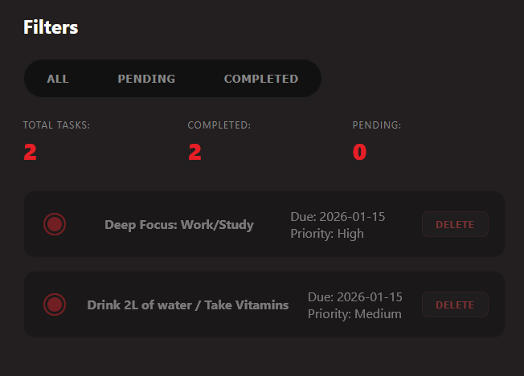
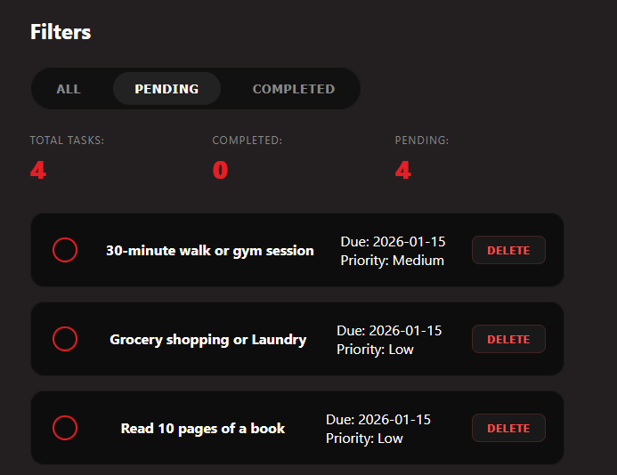
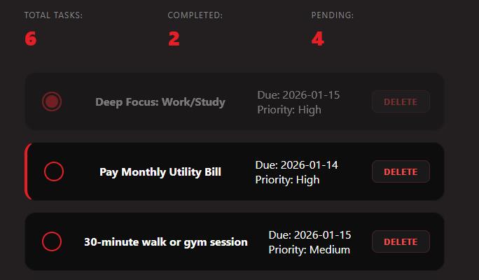

# dot - Smart Task Planner

A web-based task management application that helps users organize, prioritize, and track tasks efficiently. Built with **HTML, CSS, and JavaScript**, this app includes smart features like overdue task highlighting, priority sorting, filters, and task summaries.

---

## Features

- **Add tasks** with title, due date, and priority (Low / Medium / High)  
- **Mark tasks as completed** with visual strike-through styling  
- **Delete tasks** easily  
- **Filter tasks** by All, Pending, or Completed  
- **Priority-based sorting** for better organization  
- **Overdue task detection** (highlighted in red)  
- **Task summary**: Total, Completed, Pending, Overdue  
- **Persistent storage** using LocalStorage (tasks remain after page refresh)  
- **Responsive UI** for desktop and mobile  

---

## Screenshots

### 1. Task Form


### 2. Task Add


### 3. Task Filters & Summary





### 4. Overdue Task Highlight


---

## Technologies Used

- **HTML5** – structure  
- **CSS3** – styling and responsive design  
- **JavaScript (Vanilla)** – DOM manipulation, event handling, logic  
- **LocalStorage** – persistent data storage  

---

## How to Use

1. Open `index.html` in a browser  
2. Add a task using the input form (title, due date, priority)  
3. Use **filters** to view All, Pending, or Completed tasks  
4. Mark tasks as **completed** using the checkbox  
5. Delete tasks using the **delete button**  
6. View the **summary section** for task counts  
7. Tasks are saved automatically in LocalStorage  

---

## Project Structure

```

Smart-Task-Planner/
│
├── index.html
├── css/
│   └── style.css
├── js/
│   └── app.js
├── assets/
│   └── images/
│   └── screenshots/
└── README.md

```

---

## Future Enhancements

- Add **drag-and-drop** task reordering  
- Export task list as **CSV or PDF**  
- Add **user login** for multi-user support  
- Add **dark mode toggle**  
- Integrate **notification reminders** for upcoming tasks  

---

## GitHub Repository

Check the live project here: [Smart Task Planner](https://github.com/N-Amasha/dot-Smart-Task-Planner)
```
